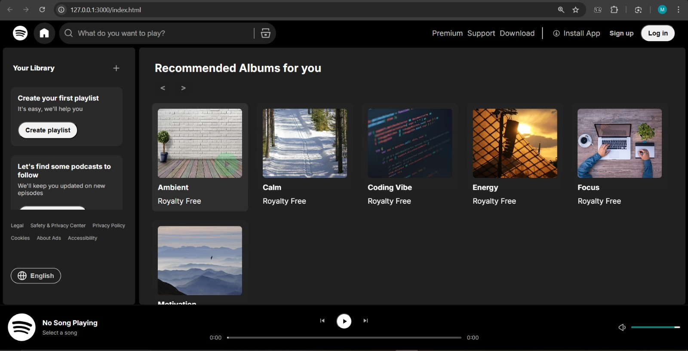

# 🎵 Spotify UI Clone — Vanilla JS Web Player


A clean, **pixel-aware recreation** of Spotify's web player built using **only HTML, CSS, and vanilla JavaScript**.  
Designed to demonstrate production-ready front-end fundamentals: responsive UI, state management, asynchronous data handling, and accessible audio controls — all without frameworks.

---

## ✨ Why this project matters

- **🎯 End-to-end front-end ability** — UI design → client-side logic → media playback
- **📚 No-framework discipline** — demonstrates deep DOM & JS knowledge (ES6+, `async/await`, Promises)
- **💬 Production-level patterns** — async data loading, resilient fallback strategies, event-driven UI synchronization, and predictable state management without frameworks

---

## 🎮 Live Demo & Preview

**[👉 Live Demo](https://phenomenal46.github.io/Spotify-UI-Clone/)**



---

## ⚡ Key Features

- **🎨 Responsive Album Grid** — dynamically rendered playlist/album cards from JSON metadata; mobile-first layout using CSS Grid & Flexbox
- **🎵 Full-featured Audio Player** — play/pause, seek, previous/next, volume, mute, and keyboard-accessible controls
- **↩️ Navigation History** — back/forward buttons with custom state stack (not native History API)
- **🔄 Graceful Fallbacks** — `fetch()` metadata with fallback to in-memory mock database on network failure
- **♿ Accessibility-minded** — semantic markup and keyboard controls for core interactions
- **🏷️ Categorized Albums** — Ambient, Calm, Coding-vibe, Energy, Focus, Motivation

---

## 🛠️ Tech Stack

| Technology | Details |
|-----------|---------|
| HTML5 | Semantic, accessible markup for screen readers |
| CSS3 | Grid, Flexbox, custom properties, responsive design |
| JavaScript ES6+ | `async/await`, Promises, event handling, DOM manipulation |
| Web Audio API | Native `<audio>` element for playback control |
| Fetch API | Asynchronous data loading with error handling |
| Vanilla JS | No external libraries; plain objects for state management |
| GitHub Pages | Static deployment; zero build configuration |

---

## 📊 Skills Demonstrated

✅ DOM manipulation and event-driven UI updates  
✅ Asynchronous data loading with resilient fallbacks  
✅ State management (queue, index, play state) without frameworks  
✅ Custom navigation stacks (back/forward history)  
✅ Audio event handling & synchronization  
✅ Defensive error handling & progressive enhancement  
✅ Responsive design & accessible controls  

---

## 📁 Project Structure

```
├── index.html              # Main HTML shell
├── script.js               # Application logic & player controls
├── css/
│   ├── styles.css          # Core styling
│   └── utility.css         # Utility classes
└── assets/
    ├── albums/             # Album covers and audio files
    ├── icons/              # SVG icons
    └── screenshots/        # Preview images
```

---

## 🔍 Implementation Highlights

- **Async data loading:** `fetch()` with defensive `try/catch`; falls back to in-memory mock database on network failure.

- **State management:** Plain JS objects (`currentQueue`, `currentSongIndex`, `isPlaying`, `currentView`) track UI state without external libraries.

- **Event-driven player:** Native `<audio>` listeners (`timeupdate`, `loadedmetadata`, `ended`) keep timeline and seek bar synchronized.

- **Custom navigation stacks:** `backStack` and `forwardStack` arrays enable intuitive back/forward behavior across views.

- **Graceful degradation:** Defensive null-checks and error handling prevent crashes; missing assets show friendly messages.

- **Separation of concerns:** Data, rendering, events, and state logic are cleanly separated for easy extension.
---

## 🚦 Future Improvements

- 💾 Persist playlists to `localStorage` or IndexedDB
- 🧪 Add unit/integration tests (Jest + DOM testing library)
- 🎨 Audio visualizer using Web Audio `AnalyserNode`
- 🔌 Integrate real streaming APIs (OAuth & licensing considerations)
- 🎯 Convert to component-based architecture (React/Vue) and evaluate trade-offs

---

## 📜 License
MIT License - see [LICENSE](LICENSE) for details.

### Music & Assets

All music tracks included in this project are **royalty-free** and do not require attribution. The tracks are sourced from royalty-free libraries and are provided for educational and demonstration purposes only.


